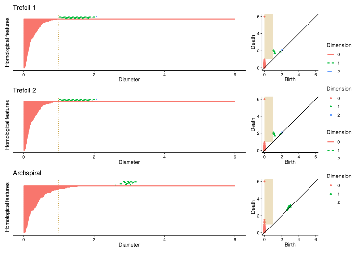

## Persistence diagrams

Topological data analysis (TDA) is a rapidly growing field that uses techniques
from algebraic topology to analyze the shape and structure of data. At its core,
TDA provides tools to understand the geometric and topological features of
datasets across multiple scales, with persistent homology (PH) being one of its
fundamental techniques.

The documentation of the [{phutil}](https://tdaverse.github.io/phutil/) package provides an [overview of persistent homology](https://tdaverse.github.io/phutil/articles/validation-benchmark.html#definitions). For now, know that the result of
this procedure is a **persistence diagram**: a multiset (set with multiplicity)
of points in the plane---usually the upper-half plane and most often the first
quadrant. Persistence diagrams encode topological features of different
dimensions, and a single diagram may encode features of one or all dimensions.
By **persistence data**, we mean a data structure that encodes diagrams of all
dimensions, and possibly many diagrams coming from data sets of a common type.

The goal of [{inphr}](https://tdaverse.github.io/inphr/) is precisely to deal with comparing populations of persistence
diagrams coming from data sets of different types. This is classically called the
task of making inference on the basis of some collected data. Several R packages
include inferential capabilities for persistence diagrams, including:

-   [{TDA}](https://cran.r-project.org/package=TDA) which focuses on statistical
analysis of PH and density clustering by providing an R interface for the
efficient algorithms of the C++ libraries
[GUDHI](https://project.inria.fr/gudhi/software/),
[Dionysus](https://www.mrzv.org/software/dionysus/) and
[PHAT](https://bitbucket.org/phat-code/phat/). This package also implements
methods from @fasy2014confidence and @chazal2014stochastic for analyzing the
statistical significance of PH features.
-   [{TDAstats}](https://cran.r-project.org/package=TDAstats) which provides a
comprehensive toolset for conducting TDA, specifically via the calculation of PH
in a Vietoris-Rips complex [@wadhwa2018tdastats].
-   [{TDAkit}](https://cran.r-project.org/package=TDAkit) which provides a
variety of algorithms to learn with PH of the data based on functional summaries
for clustering, hypothesis testing, and visualization
[@wasserman2018topological].

While these packages have made inference on persistence diagrams available to the
R community, they only deal with inference on a single diagram using bootstrap
resampling ({TDA}), or only offer inference to compare two diagrams by permutations
({TDAstats}), or only compare functional summaries of groups of persistence diagrams
to answer whether they come from the same underlying distribution ({TDAkit}).

The {inphr} package aims at going one step further by offering two sets of functions
for making inference:

1. in the space of persistence diagrams (@sec-pd) for testing whether multiple collections of persistence diagrams come from the same underlying distribution;
2. in functional spaces (@sec-functions) for localizing differences between multiple collections of persistence diagrams on the domain of some functional summary of them.

The following sections showcase these two kinds of inference.

## Inference in the space of persistence diagrams {#sec-pd}

### Distances between persistence diagrams

Two persistence diagrams $X$ and $Y$ are canonically compared using
**Wasserstein distances**.
These are a family of metrics determined by a $q$-Minkowski distance on the plane
and a $p$-norm on the distances between pairs of points matched via some $\varphi : X \to Y$:

$$ \left( \sum_{x \in X}{{\lVert
x-\varphi(x) \rVert_q}^p} \right)^{1/p} $$

The distance $W_p^q(X,Y)$ is defined to be the infimum of this expression over all possible matchings.
See this
[vignette](https://tdaverse.github.io/phutil/articles/validation-benchmark.html) from the {phutil} package
on distances for more detail, or @cohen2010lipschitz and @bubenik2023exact for
detailed treatments and stability results on these families of metrics.

In R, using the TDAverse, computation of the distance matrix is offered by the {phutil} package which is therefore a hard dependency of {inphr}.

Functions in {inphr} therefore accept:

- either two objects of class 'persistence_set' produced by `phutil::as_persistence_set()` representing the two samples;
- or an object of class 'persistence_set' produced by `phutil::as_persistence_set()` representing the contatenation of the two samples and a vector of two integers providing the sample sizes;
- or an object of class 'dist' typically produced by `phutil::bottleneck_pairwise_distances()` or `phutil::wasserstein_pairwise_distances()` and a vector of two integers with the sample sizes.

### Permutation inference

The package currently includes a function to compare two samples of persistence diagrams. The statistical method for doing that is described in @lovato2021multiscale. Substantially, it performs inference in two steps:

1. Pre-computation of the matrix $D$ of pairwise distances between persistence diagrams within and between samples;
2. Permutations of the rows and columns of $D$ to approximate the distribution of one more more test statistics.

Let $F_1$ be the probability distribution that generated the first sample and $F_2$ be the probability distribution that generated the second sample. Inference by permutations helps answering the following hypothesis test:

$$
H_0 : F_1 = F_2 \quad \mbox{v.s.} \quad H_a : F_1 \ne F_2.
$$

Differently from classic parametric inference in which the null hypothesis typically assumes equality of the mean parameters or the variance parameters, it is critical that the null distribution be that the entire probability distributions be the same. This is essential because only then can we permute the labels of statistical units under the null hypothesis.

However, depending on the test statistic that is used, the test only focuses on comparing some features of the probability distributions. For instance, if one uses the distance between the Frechet means as test statistic, the test will detect differences in means between the two ditributions but will be blind to differences in variances for example. For this reason, one can use multiple test statistics to make the test sensitive to differences in several moments of the distributions. This is called non-parametric combination and it is described in @pesarin2010permutation. 

We use this approach in {inphr} by default to combine two test statistics that are defined in @lovato2021multiscale based solely on inter-point distances. One is sensitive to differences in means and the other to differences in variances. The dedicated function is `two_sample_diagram_test()`. It expects two input objects of class `persistence_set` as produced by `phutil::as_persistence_set()`. The user can actually choose different test statistic(s). The result of the test is a p-value that helps in making the decision of whether to reject the null hypothesis. Optionally, one can ask the function to return the permutations that have been used (`keep_permutations = TRUE`) and the permutation distribution of the combined test statistic (`keep_null_distribution = TRUE`).

### Toy examples

The {inphr} package includes the following three toy data sets.

::: {.callout-note icon="false"}
## `trefoils1` and `trefoils2`

Two sets of 24 persistence diagrams each computed from noisy samples of trefoil knots. Each sample consists of 120 points sampled from a trefoil knot with Gaussian noise (sd = 0.05) added. Vietoris-Rips persistence was computed up to dimension 2 with maximum scale 6 using `TDA::ripsDiag()`. Generated with seed 28415.
:::

::: {.callout-note icon="false"}
## `archspirals`

A set of 24 persistence diagrams computed from noisy samples of 2-armed Archimedean spirals. Each sample consists of 120 points sampled from an Archimedean spiral, embedded in 3D with a zero z-coordinate, then Gaussian noise (sd = 0.05) added. Vietoris-Rips persistence was computed up to dimension 2 with maximum scale 6 using `TDA::ripsDiag()`. Generated with seed 28415.
:::

The bar code and diagram representations can be found in @fig-toydata.

{#fig-toydata}

We can therefore use `inphr::two_sample_diagram_test()` to compare:

- `trefoils1` and `trefoils2` with expected output that there is not enough statistical evidence to reject the hypothesis that the two samples come from the same distribution;
- `trefoils1` and `archspirals` with expected output that we can reject the hypothesis that the two samples come from the same distribution.

The following code performs the test between the two trefoil samples using only the first 5 statistical units:

```{r}
library(inphr)

withr::with_seed(1234, {
    two_sample_diagram_test(trefoils1[1:5], trefoils2[1:5])
})
```

As expected, the test is not able to reject the null hypothesis. By default, the function uses `B = 1000` permutations, which makes the p-value resolution of `r 1/1001`. If we compare instead `trefoils1` against `archspirals`, again using only the first 5 statistical units, we get:

```{r}
withr::with_seed(1234, {
    two_sample_diagram_test(trefoils1[1:5], archspirals[1:5])
})
```

As expected, the test does detect the difference despite the small sample size.

## Inference in the functional spaces {#sec-functions}

### Functional representations of persistence homology

### Interval-wise testing for functional data

## A stable, modular, extensible package collection

We are part of a loose-knit team of R developers interested in fostering a more
sustainable and convenient package collection for TDA, which we've come to call
the [TDAverse](https://github.com/tdaverse). The collection ranges from
low-level, general-purpose packages like {tdaunif} and {phutil}, through
purpose-fit but interoperable packages like {ripserr}, {plt} or {inphr}, to Tidyverse
extensions like {ggtda} and {tdarec}.

Development of {inphr} was directly funded by an Infrastructure Steering
Committee grant from the R Consortium, together with several other packages that
will be presented in upcoming blog posts. While we hope to secure funding for
other specific projects in future, we also invite interested developers or users
to reach out with their issues or ideas.

## References